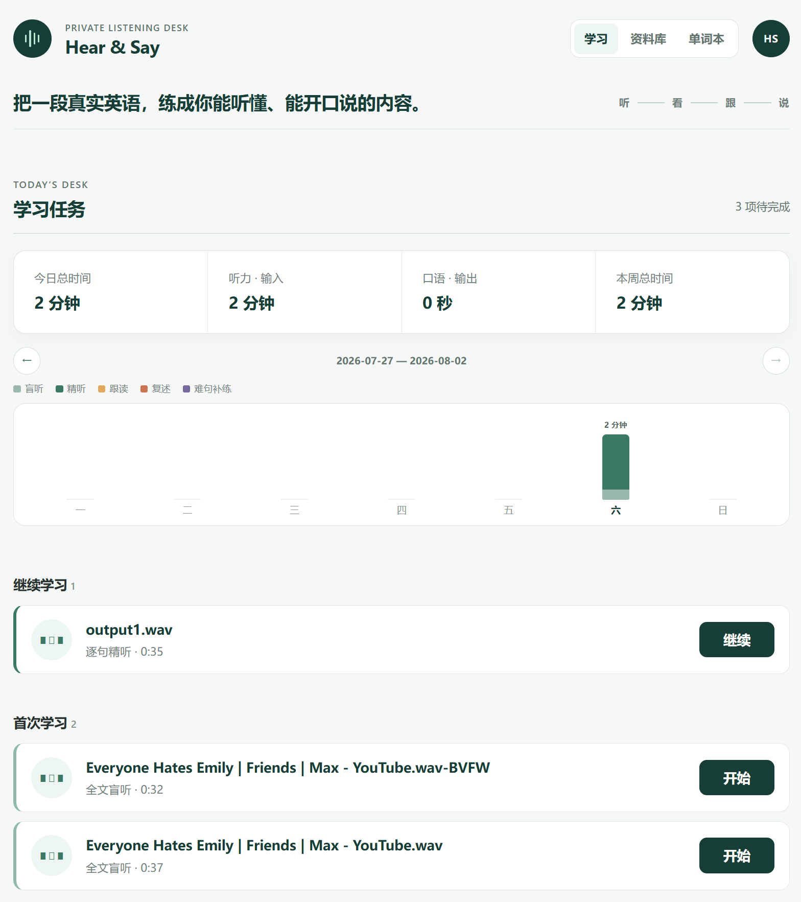
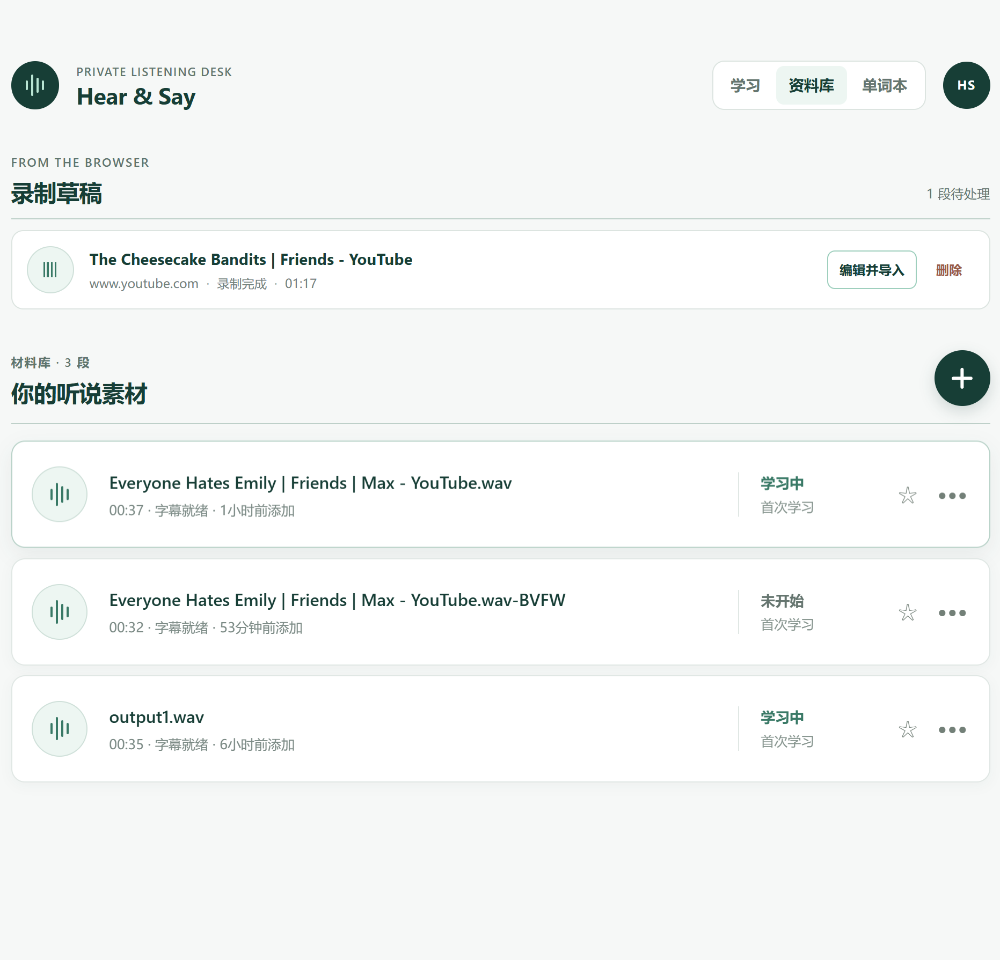
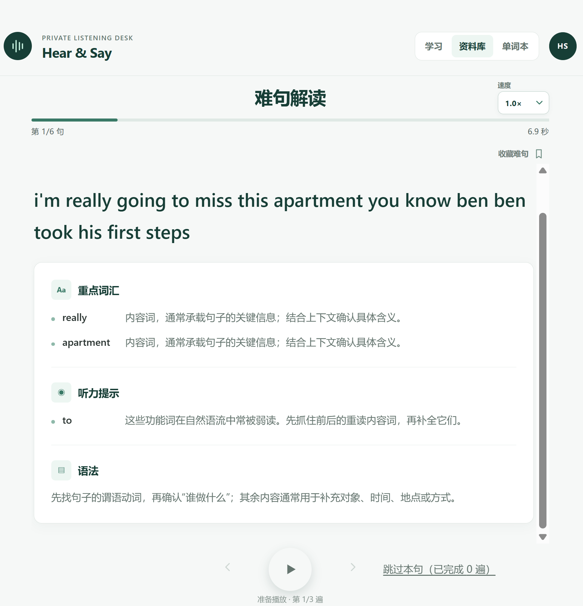
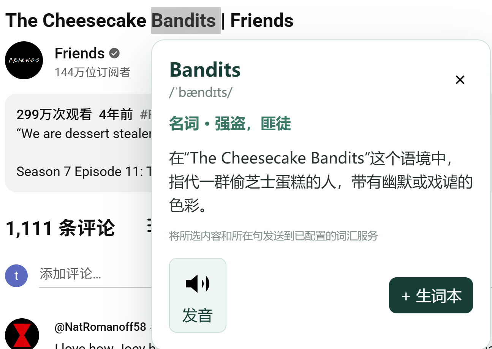

# Hear & Say

[English](README.md) | 简体中文

把你在网上遇到的真实英语，练成真正能听懂、能开口说的内容。

> **早期预览版** — Hear & Say 正在积极开发中，目前需要以“已解压的 Chrome 扩展程序”方式安装。

[试用最新版本](https://github.com/tutar/hear-say/releases) · [了解学习流程](#如何使用) · [参与贡献](CONTRIBUTING.zh-CN.md)



## Hear & Say 是什么？

Hear & Say 是一个本地优先的 Chrome 英语听说训练扩展。它能把浏览器中的音频，或你已有的本地音频文件，变成一套包含逐句精听、跟读、全文盲听、复述与复习的引导式学习流程。

它也把浏览网页时遇到的单词接入同一个学习空间：选中单词或短语，主动请求语境解释，播放美式英语发音，再决定是否加入单词本。

## 为什么做 Hear & Say？

英语学习并不缺播放器、翻译工具或学习方法。真正的问题是它们彼此割裂：视频里的好材料很难进入练习流程，浏览网页遇到的生词也很难沉淀到之后的学习中。

Hear & Say 在浏览器里连接这些环节：

```text
浏览器内容 → 学习材料 → 听说训练 → 生词积累 → 按计划复习
```

## 如何使用

1. 导入本地音频，或者主动录制所选浏览器标签页中的声音。
2. 将音频发送到你配置的转写服务，并检查生成的逐句时间轴。
3. 完成首次学习：逐句精听 → 难句跟读 → 全文盲听 → 段落复述。
4. 按计划复习：有收藏难句时先进行难句补练 → 全文盲听 → 段落复述。
5. 想跳出固定流程时使用“随心听”，自由控制全文或单句播放。

## 功能

### 把浏览器声音变成学习材料

录制用户主动选择的标签页声音，不依赖特定平台的下载接口。目前已验证 YouTube 和 Bilibili，并适用于普通浏览器标签页中播放的音频。不支持 DRM 受保护内容和无痕标签页。

录制时可以暂停和继续而不拆分材料，也不影响当前声音播放；完成后可以移除广告、误录等区间，再把保留的音频合并为一份材料。




### 完成一套听说学习闭环

在逐句训练中控制倍速和重复播放，按需显示翻译、句子解析与意群。只有用户主动收藏的难句才会进入之后的难句补练，系统不会自动判断哪些句子困难。



### 把划词结果沉淀到单词本

在普通网页或逐句精听中选中不超过八个英文单词。只有点击“翻译”后，Hear & Say 才会请求语境解释；只有点击“+ 生词本”后，词卡才会保存。



### 继续学习、按时复习或随心听

- 在一个页面查看首次学习和所有已生成的复习轮次。
- 按日、按周统计盲听、精听、跟读、复述和难句补练时间。
- 在跟读和复述详情中分别查看听与说的用时。
- 随心听支持单句和列表模式；每份材料保存播放位置，播放偏好则在材料间共享。

## 为什么选择 Chrome 扩展？

[Echo Loop](https://github.com/echo-loop/Echo-Loop) 的结构化听说训练流程启发了 Hear & Say。Hear & Say 选择了不同的产品载体，而不是把它直接移植到浏览器：

| 问题 | 来自 Echo Loop 的启发 | Hear & Say 的重点 |
| --- | --- | --- |
| 在哪里学习？ | 专注的学习体验 | 就在日常学习和工作的浏览器中 |
| 材料如何进入流程？ | 把有意义的音频带入结构化训练 | 导入本地音频，或录制用户主动选择的浏览器标签页 |
| 网页中遇到的单词怎么办？ | — | 对主动划选的内容生成语境解释，并把选中的词加入单词本 |

Hear & Say 是独立的非官方项目，不是 Echo Loop 的分支、浏览器移植版或官方项目，与 Echo Loop 不存在隶属或背书关系。

## 试用

Hear & Say 目前通过 GitHub Releases 发布：

1. 从最新的 [GitHub Release](https://github.com/tutar/hear-say/releases) 下载 `hear-say-vX.Y.Z-chrome.zip`。GitHub 自动生成的 “Source code” 压缩包不是可直接加载的扩展。
2. 解压文件，打开 `chrome://extensions`，启用“开发者模式”。
3. 点击“加载已解压的扩展程序”，选择解压后的目录。
4. 首次打开时，在“AI 服务”中配置音频转写和词汇解释。你可以离开设置页，但尚未完成配置的相关功能会保持禁用。

### 转写配置

AssemblyAI 是默认提供商。先在 [AssemblyAI dashboard](https://www.assemblyai.com/dashboard) 注册并复制 API Key，然后在“AI 服务”中粘贴密钥，选择 Universal-3.5 Pro 或 Universal-2；音频语言默认英语，只有确实需要时才改为自动检测。Hear & Say 会上传音频、提交转写任务，并轮询到带时间戳的结果完成。

如需使用其他服务，选择“OpenAI 兼容”，填写 Base URL、模型、语言和可选 API Key。服务必须在 Base URL 下支持 `POST /audio/transcriptions`，并返回带时间戳的 OpenAI `verbose_json`。例如，本地 FunASR 可以使用 `http://localhost:8021/v1` 作为 Base URL，并填写 `sensevoice` 等模型；具体值及浏览器跨域配置取决于你的部署。

Chrome 只会请求访问当前选中的端点。如果请求被阻止，请检查服务是否允许 Chrome 扩展访问，以及地址和网络是否正确。转写失败时，Hear & Say 会保留材料和原始音频，供你用同一提供商重试或导入 SRT/VTT 字幕；应用不会静默切换提供商。

## 本地优先设计

- 材料、录音、句子时间轴、难句收藏、生词、学习进度和设置保存在扩展的浏览器本地存储中。
- 音频只会发送到用户主动配置并授权的转写端点。
- 词汇请求只包含选词和所在句，不包含网页 URL、网页标题、音频名称或完整页面内容。
- API Key 保存在扩展本地存储中，不会被主动写入界面、错误信息或日志。
- Hear & Say 本身不提供托管后端。

卸载扩展或清除浏览器数据可能永久删除本地学习数据。请备份无法承受丢失的内容。

## Roadmap

### 现在可用

- 本地音频导入与用户主动发起的浏览器标签页录音
- 结构化首次学习、自动生成的复习轮次与随心听
- 划词语境解释、Chrome TTS 发音与本地单词本
- 每日和每周听说时间统计

### 持续改进

- 录音稳定性、中断恢复与存储空间提示
- 验证更多媒体网站
- 录音和材料编辑体验
- 兼容更多 OpenAI 接口格式的转写服务

### 探索中

- 发布到 Chrome Web Store
- 跨设备同步
- 支持更多浏览器

“探索中”只表示正在考虑的方向，不代表确定功能或发布时间。

## 致谢

Hear & Say 的灵感来自 [Echo Loop](https://github.com/echo-loop/Echo-Loop) 及其结构化精听和口语练习方法。感谢它的创建者和贡献者开放这项工作。

Hear & Say 使用了包括 [WXT](https://wxt.dev/)、[React](https://react.dev/) 和 [Dexie.js](https://dexie.org/) 在内的开源项目。

## 开发与贡献

开发环境、架构边界、测试、贡献规则和发布流程请参阅 [CONTRIBUTING.zh-CN.md](CONTRIBUTING.zh-CN.md)。

## 开源协议

Hear & Say 使用 [Apache License 2.0](LICENSE) 开源协议。
